# UART from scratch

## Overview
This project implements a UART communication system in Verilog, consisting of two core components: a receiver (RX) module and a transmitter (TX) module. The RX module is responsible for deserializing incoming 8-bit data packets based on a defined baud rate, sampling each bit over a fixed number of clock cycles to ensure accurate reception. The TX module handles the reverse operation, serializing 8-bit data for transmission by inserting start and stop bits around the data payload. Both modules are designed to operate with a 25 MHz clock and a baud rate of 115200, resulting in 217 clock cycles per bit. The system is rigorously tested through a comprehensive testbench that simulates the sending and receiving of multiple 8-bit values. The testbench validates correctness by comparing the received data against expected values after each transmission, using controlled timing delays and waveform observations to ensure protocol compliance and data integrity.  The clock frequency can be modified to run at a different frequency depending the board or system.  Changing clock frequency would also require clock cycles per bit to modified as well.

## Results

### Reciever Results

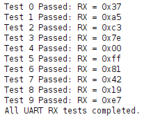
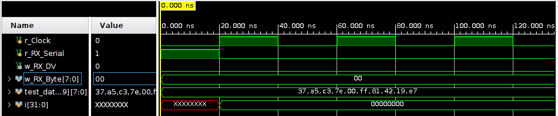
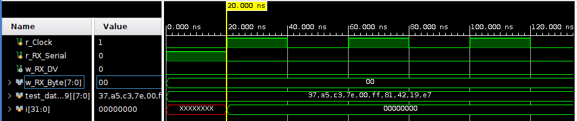
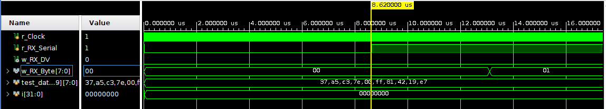
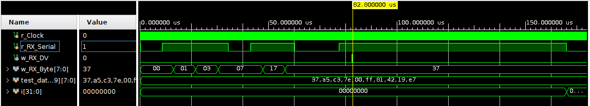
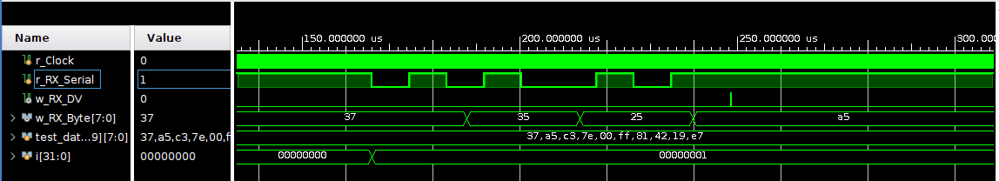

### Transmitter Results
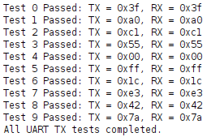
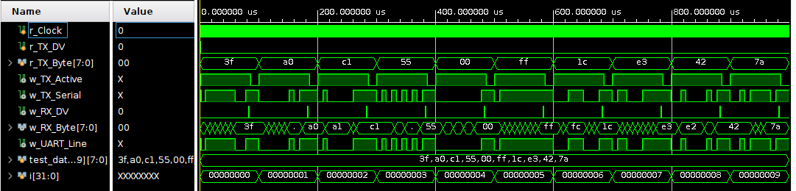
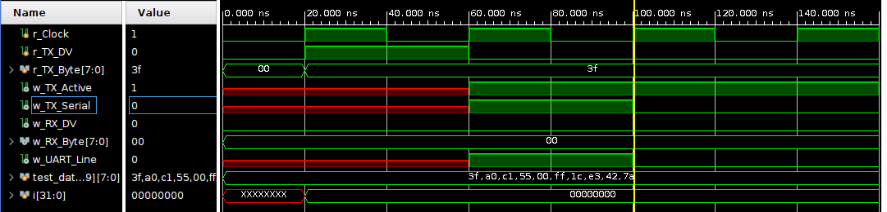
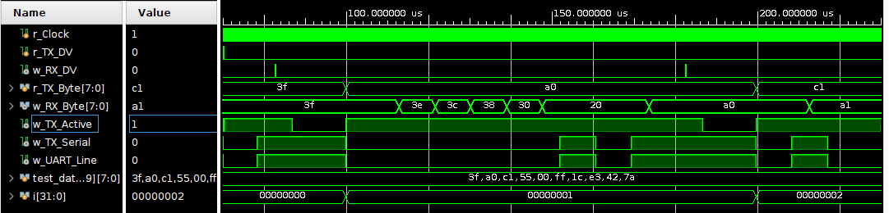
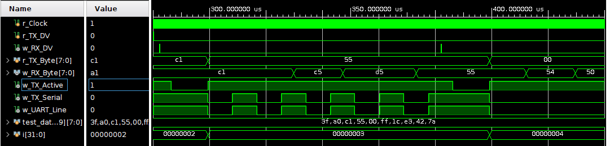
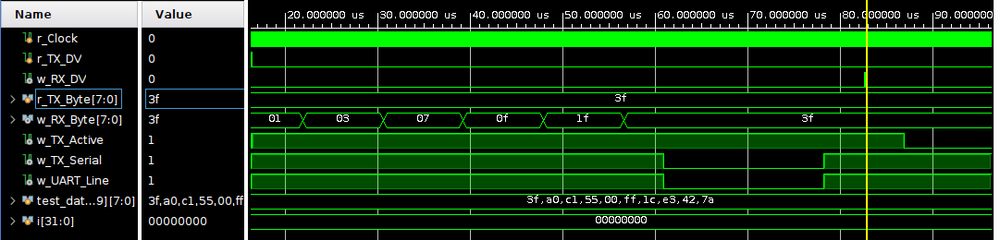

## To Do 
- Obtain USBUART Pmod from Digilent and connect UART module to serial terminal to send data from PC to Zybo.